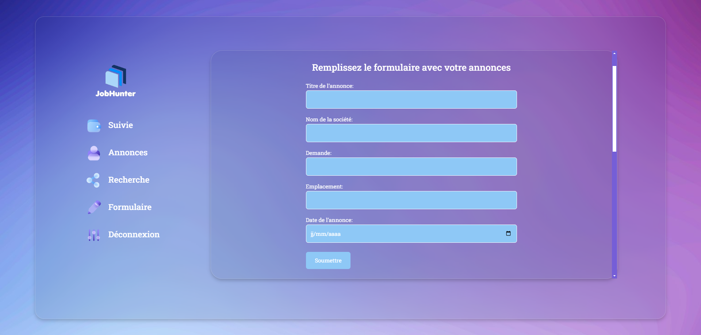

# JobHunter

Job Hunter est une application web dynamique conçue avec Vue.js, offrant une interface conviviale pour suivre efficacement les candidatures de stage. Cette application permet aux utilisateurs de gérer leur processus de recherche de stage de manière organisée et méthodique.

Grâce à des fonctionnalités telles que la création de profils , le suivi des candidatures, et la gestion des rappels pour les entretiens, "Job Hunter" vise à simplifier le processus de recherche de stage pour les étudiants.


difficulté rencontré : la gestion du temps 

on aurait pu faire : la base de donnée séparer entre chaque users 

## Project Setup

```sh
npm install
```

### Compile and Hot-Reload for Development

```sh
npm run dev
```

### Compile and Minify for Production

```sh
npm run build
```


### ScreenShots of the web app


Page création de compte


Page de connexion


Page de suivie de candidature


Page Formulaire de création d'annonces de stage



Page pour stocker les lettres de motivations


